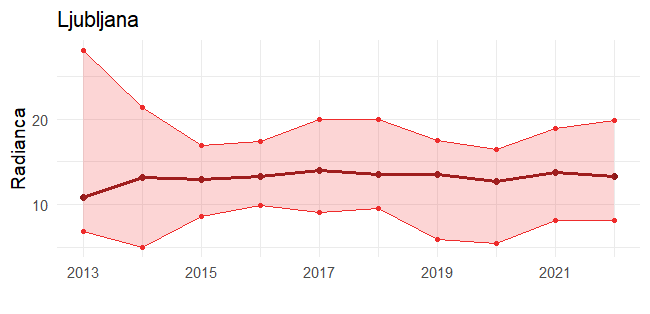
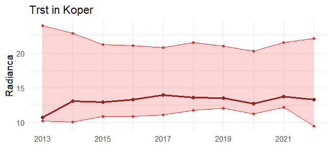
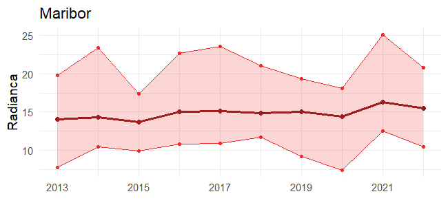
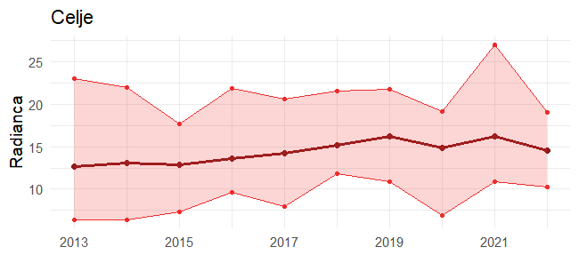
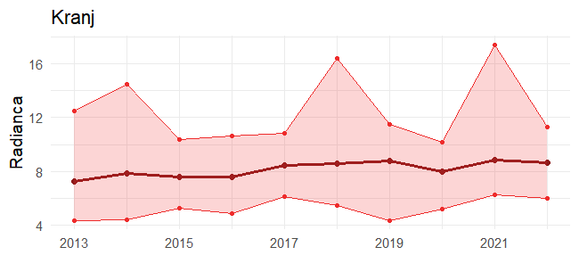

# 🌍 SVETLOBNA ONESNAŽENOST 2013 - 2022

Ta repozitorij vsebuje vizualizacije svetlobne onesnaženosti za izbrana slovenska mesta.

## 📌 ANIMACIJE SVETLOBNE ONESNAŽENOSTI

---

### <h2 align="center"><b>LJUBLJANA</b></h2>

    
    

        
        <canvas class="overlayCanvas" data-target="pngLjubljana" style="position: absolute; top: 0; left: 0;"></canvas>
    

---

### <h2 align="center"><b>TRST IN KOPER</b></h2>

    
    

        
        <canvas class="overlayCanvas" data-target="pngTrstKoper" style="position: absolute; top: 0; left: 0;"></canvas>
    

---

### <h2 align="center"><b>MARIBOR</b></h2>

    
    

        
        <canvas class="overlayCanvas" data-target="pngMaribor" style="position: absolute; top: 0; left: 0;"></canvas>
    

---

### <h2 align="center"><b>CELJE</b></h2>

    
    

        
        <canvas class="overlayCanvas" data-target="pngCelje" style="position: absolute; top: 0; left: 0;"></canvas>
    

---

### <h2 align="center"><b>KRANJ</b></h2>

    
    

        
        <canvas class="overlayCanvas" data-target="pngKranj" style="position: absolute; top: 0; left: 0;"></canvas>
    

---

### <h2 align="center"><b>NOVO MESTO</b></h2>

    
    

        
        <canvas class="overlayCanvas" data-target="pngNovoMesto" style="position: absolute; top: 0; left: 0;"></canvas>
    

---

## 🔗 POVEZAVE
🌍 [NASA Earthdata - Nighttime Lights](https://www.earthdata.nasa.gov/topics/human-dimensions/nighttime-lights)  
🌍 [Temno Nebo Slovenija](http://www.temnonebo.si/)
